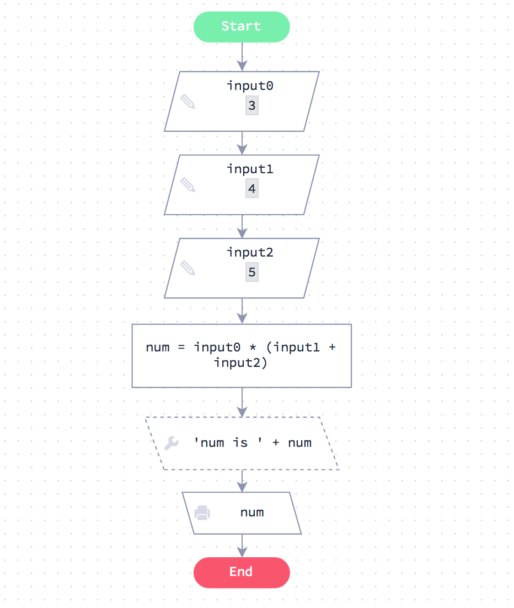

# Expresiones numéricas 

Empecemos partiendo de un diagrama de flujo que demuestre una expresión numérica.

Si pasa por el gráfico verá que evalúa las expresiones A ∗ (B + C)

En la siguiente página verá exactamente el mismo código escrito en JavaScript



## Código equivalente

Abajo está el código JavaScript equivalente al diagrama de flujo de la página anterior.

Si ejecuta el código verá que se ocupa de la expresión numérica exactamente de la misma manera que hizo el gráfico anterior.

```js

// Obtener inputs (entradas) desde la línea de comandos
var input0 = 1213 //  prompt ()
var input1 = 123 //  prompt ()
var input2 = 322 //  prompt ()

// Más código
var num = input0 * (input1 + input2)

// Una sentencia de debug (depuración)
console.info ('num is' + num)

// Output (Salida)
console.log (num)

```
[Ejecutar Código]()

## Adición

**Reto**

Su código debe esperar un input. Todo lo que necesitas hacer es añadir 12 al input y dar un `output` al resultado.

```js

// Obtener un input desde la línea de comandos
// Asegúrese de que el input se almacena como un número
var input = 12 // prompt("input ") 

// Su código va aquí

```

[Ejecutar Código]()

## A * (B + C / 3)

Pasamos tres inputs, A, B y C.

Debe dar salida A* (B + C/3).

```js

// Obtenga nuestro input desde la línea de comandos
// Asegúrese de que el input se almacene como un número
var A = 12 // prompt("input: ") 
var B = 13 // prompt("input: ") 
var C = 14 // prompt("input: ") 

// Su código va aquí

```

[VERIFICAR CÓDIGO](https://github.com/aocsa/LaboratoriaJS/blob/master)


