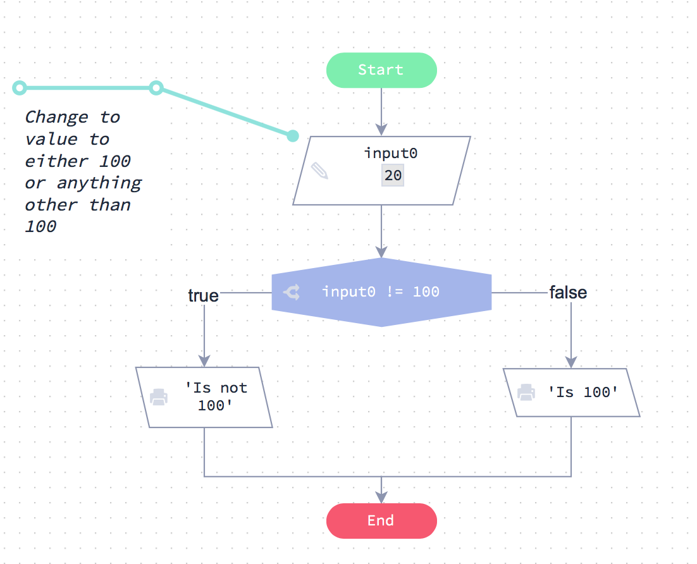
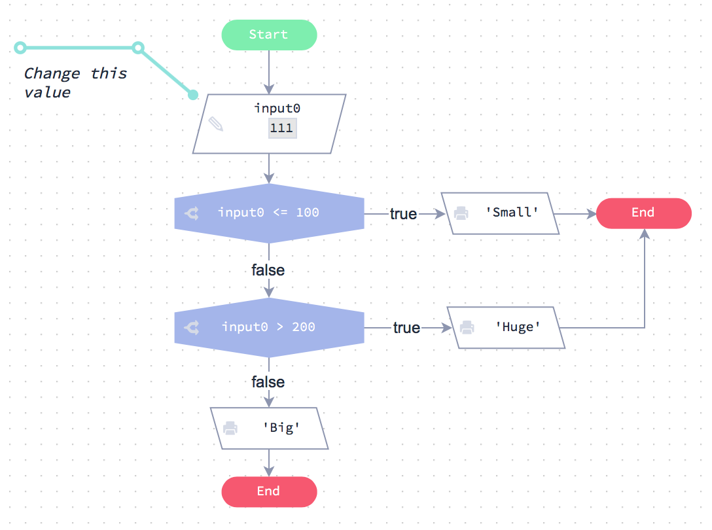

# Condiciones

Echa un vistazo a la diagrama de flujo; el gráfico muestra el uso de una condición.

**Ejemplo**


En este ejemplo, la condición es `input0 > 100`. Puede ver cómo esta condición puede ser verdadera o falsa. Estos son los únicos dos posibles resultados de la decisión.

## Condiciones en código

En esta sección se muestra el código JavaScript equivalente al diagrama de flujo de la sección anterior.

Si ejecuta el código verá que la sentencia condicional hace exactamente lo mismo que el diagrama de flujo.


```js

// Obtener el input desde la línea de comandos
var number = 20 // prompt("input");

// Su código  

// output del número del input del programa
console.log ('La entrada de línea de comandos es:' + number)

// Y aquí viene nuestra declaración ‘if'
if (number > 100) {
  console.log ('grande')
}
else {
  console.log ('pequeño')
}

```
[Ejecutar código]()

Echa un vistazo a cómo funciona este código:

En primer lugar, los datos de prueba de nuestra variable de entrada `number`, proviene de un `prompt()`.

```text
var number = prompt("input"); // teclear el número 20
```

Y aquí viene la parte importante. Se utiliza una instrucción `if` para comprobar si `number` es mayor que 100\. Si lo es, entonces emitimos la cadena `'grande'`. De lo contrario, emitiremos la cadena `'pequeño'`.

```js
if (number > 100) {
  console.log ('grande')
}
else {
  console.log ('pequeño')
}

```

## Declaraciones condicionales

Ahora vamos a ver con más detalle cómo funciona la sentencia `if`. Aquí está el código completo nuevamente:

```js
var number = 123   // prompt("input: ")
if (number > 100) {
  console.log ('grande’')
}
else {
  console.log ('pequeño')
}
```
En primer lugar, eche un vistazo a la primera línea:


**La sentencia if**

```
 if (number > 100) {
```

1. Inicie la línea con `if`.
2. Ahora especifique la condición dentro de los paréntesis `(condición)`.
3. Por último, al final de la línea se añade un `{`, conocido como una **llave**.

**Si la condición es verdadera**

**if** (si) la condición es verdadera, entonces realizas todas las instrucciones que vienen después de ella, dentro del `{``}`. En este ejemplo sólo hay una instrucción.

```
console.log ('grande')
```

Todo lo que está dentro de `{` y `}` se le denomina *bloque de código*.

**De otra manera**

Si la condición es **falsa** (not true), el bloque de código `else` se ejecuta en su lugar.

```
console.log ('pequeño')
```

**Bloques de código**

El `{` al final de la línea `if` se utiliza para iniciar un bloque de código. Una vez que se ha iniciado el bloque de código, agrega el código que desea ejecutar en las siguientes líneas. A continuación, finaliza el bloque de código con un `}`.

## Indentación

Indentación significa dejar un espacio vacío entre el margen izquierdo y el comienzo de una línea de código. En algunos lenguajes de programación como Python, la sangría es *requerida*. En estos idiomas, si no se indenta su código correctamente, no se ejecutará.

En JavaScript, su código funcionará bien sin sangría pero parecerá desordenado y puede ser difícil para otros leer y entender.

Echa un vistazo al código que está escrito sin sangría. Es difícil de leer en comparación con el código que hemos utilizado en las páginas anteriores.

```
if (number > 100) {
  console.log ('grande')

} else {
  console.log ('pequeño')
}
```

**¿Qué código se debería indentar?**

Se debe indentar todo el código dentro de un bloque de código. Los bloques de código comienzan con el carácter `{` y terminan con `}`.

```
If (number > 100) {
  aquí todo el código identado
}
```

Pronto verás otras sentencias que también tienen bloques de código, como son los ciclos `for`y`while`. Estos deben ser identados también.

```
while (contador  <= 9) {
  console.log (contador)
  contador = contador + 1
}
```

**¿Cómo se indenta código?**

Pulse la tecla de tabulación al principio de una nueva línea para identar su código. (La tecla de tabulación es la tecla con dos flechas apuntando en direcciones opuestas).

A veces los principiantes presionan la barra de espacio varias veces para sangrar su código. **No haga esto**.

Siempre use la tecla de tabulación en su lugar. Esto asegura que las sangrías sean consistentes.

En JavaScript, utilice 2 o 4 espacios para sangrar.

## Explicación de iguales

Echa un vistazo al diagrama de flujo.

 


A continuación se muestra el código JavaScript equivalente:

```js
var number = 123   // prompt("input: ")
if (number == 100) {
  console.log ('es 100')
} else {
  console.log ('no es 100')
}
```

**¿Por qué usamos ==?**

Tenga en cuenta que necesita utilizar `==` y \*\* not \*\* =.

En JavaScript (y muchos otros lenguajes de programación) `=` es el operador \* de asignación \*, no un operador de comparación. Esto significa que usted usa `==` para comparar cosas y `=`para establecer variables.

```
N = 100 // asigna N a 100
N == 100 // falso a menos que N tenga el valor 100
```

## Desafío

Le proporcionaremos un número, N.

* Si N es igual a 100, el output ‘éxito’
* De lo contrario, output ‘pierde’

Recuerde que el string distingue entre mayúsculas y minúsculas.

```js
// Obtener argumentos de la línea de comandos
// Asegúrese de que N se maneje como un número
var N = +process.argv[2]

// Su código va aquí

```

[¡Revisar código!]()


## No es igual explicado

Echa un vistazo a la tabla de Flode a la izquierda, que muestra una condición “no es igual”. A continuación se muestra el código JavaScript equivalente.




```
if (input0 != 100) {
   console.log ('no es 100')}
else {
   console.log ('es 100')
}
```

**`!=`**

Usted puede recordar de la unidad anterior que el signo `!` Significa ‘no’ por lo tanto `!=`Significa ‘no es igual’


## No es igual a (!=)

Le pasaremos un string.

* Si el string no es igual a ‘Bingo’ output ‘perdio’
* De lo contrario, output ‘exito!’

Utilice el `!=` en su condición.

```js

// Obtener argumentos de línea de comandos
Var testString = proceso.argv [2]

// Su código va aquí

```

[¡Revisar código!]()

## Dos condiciones

Ahora veamos otro ejemplo. Mira el gráfico de Flode a la izquierda. Pase a través de la tabla y verá que funciona de la siguiente manera:




Si el número es menor o igual a 100, output ‘pequeño’. Si el número es mayor que 100 y también mayor que 200 el output es ‘enorme’, si no el output es ‘grande’

Ahora haga clic en la pestaña del archivo `if2.js` en el panel izquierdo para ver cómo se escribiría el código JavaScript para hacer lo mismo.

```js

var number = 211

// Como está escrito en el gráfico de Flode
if (number <= 100) {
  console.log ('pequeño')
}
else if (number> 200) {
  console.log ('enorme')
}
else {
  console.log ('grande')
}

```

**else if (de lo contrario si)**

Eche un vistazo a la segunda condición, se utiliza la siguiente instrucción:

```
  else if (input0 > 200) {
      ...

```

El uso de `else if` significa que esta línea sólo se ejecutará si la primera condición `if` fue `false`.

Esta es la forma general en que JavaScript evalúa las sentencias `if`.

```text
if (condicion1) {
    hace algo
} else if (condicion2) {
    hace otra cosa
} else if (condicion3) {
    hace otra cosa
} else {
    hace esto
}
```

* Se evalúa la primera condición `if`. Si es cierto, entonces se ejecutará el bloque de código y la ejecución saltará al final de todas las condiciones `if / else`.
* Si es falso, entonces todas las condiciones `else if` serán evaluadas a su vez hasta que una de ellas tenga una condición `true`.
* Si ninguna de las condiciones `if` o `else if` se evalúan como `true`, entonces el bloque de código `else` se ejecutará automáticamente (si se utilizara).

## Corregir los errores

Corrige el código partido a la izquierda

* ¡Puede haber más de un error!
* Asegúrese de que su programa funcione en ambos casos: `str` es al inicio igual a ‘there’ y luego no es igual.

```

// Obtener argumentos de la línea de comandos
input0 = "there" // prompt("input: ")

// Su código va aquí
if (input0 = 'there') {
  console.log (1)
}
else {
  console.log (0)

```
[¡Revisar código!]()

## Corregir más errores

Corrige el código partido a la izquierda. Podría haber uno o más errores.

```js

// Obtener un input desde la línea de comandos
var text = "Bingo" // prompt("input: ")

if (texts != 'Bingo')
  console.log ('Perdió')
}
else {
  console.log ('Acertó!')

```

[¡Revisar código!]()

## Los `1` ó `0`

Se le proporciona un input numérico que será 1 o 0.

Si el número es 1, el output es “prender”, si es 0 el output es"apagar".

```js
// Obtener argumentos de la línea de comandos
// Asegúrese de que sean tratados como números
var N = "prender" // prompt("input: ")

// Su código va aquí

```

[¡Revisar código!]()

## True o False (verdadero o falso)

Este desafío está al revés.

Le proporcionamos un input de string que es “true” o “false”. Debería dar de output un número 1 si es verdadero ‘true’ o 0 si es falso ‘false’.

```js
// Obtener argumentos de la línea de comandos
var inputText = "true" // prompt("input: ")

// Su código va aquí

```

[¡Revisar código!]()

