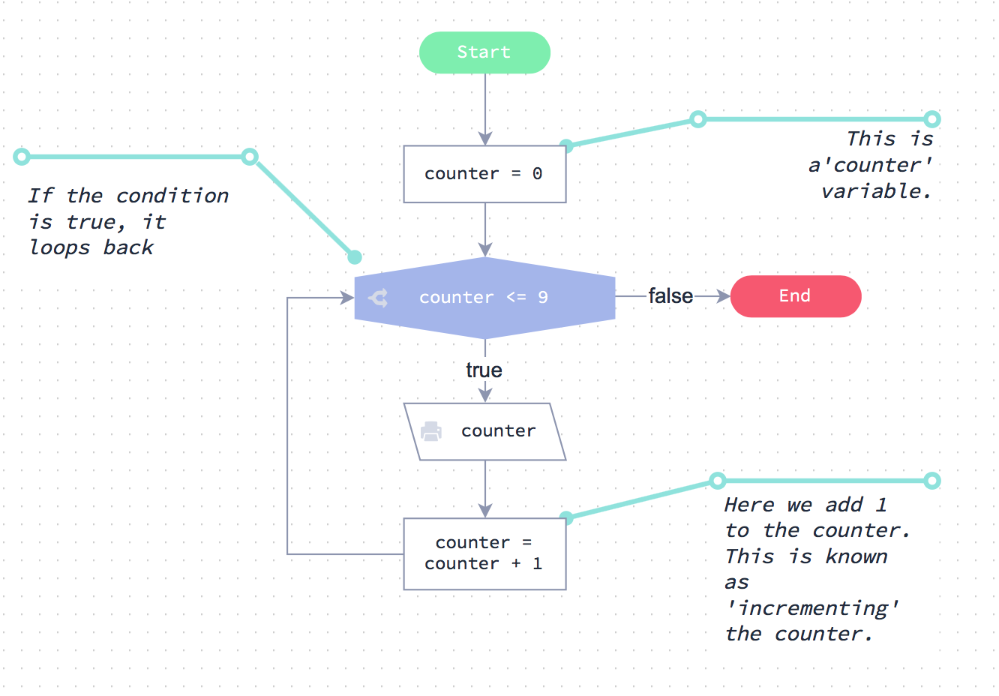

# Descripción de los Loops

Antes de comenzar a usar bucles en código, eche un vistazo al gráfico de Flode a la izquierda.

Es un bucle muy simple pero es un buen lugar para comenzar.



## El bucle while

El código que ves a la izquierda es el equivalente exacto del gráfico de Flode, pero escrito en JavaScript.

Tener un empuje en la ejecución del código:

```js
var counter = 0             // Esta es una variable 'counter'.

while (contador <= 9) {     // Si la condición es verdadera, se vuelve hacia atrás
  console.log (contador)
  counter = counter + 1   // Aquí agregamos 1 al contador. Esto es conocido
                            // como "incrementar" el contador.
}

```

[Ejecutar código]()

## While explicado

Echa un vistazo al código con más detalle. Debe ser bastante fácil de entender, ya que es muy similar al gráfico de Flode.

El bloque de código while
---- 

Eche un vistazo a la sentencia `while` y su bloque de código.

Cada sentencia while se ve así:

```js
while ( alguna_condicion) { 
    algun_código 
    algun_codigo_más 
    incluso_algun_codigo_más
}  
el código continúa ejecutándose aquí 
una vez que 'alguna_condicion' ya no es true
```

Lo que esto dice es lo siguiente: *“Mientras la condición es verdadera, ejecuta todas las sentencias de código que ocurren \** dentro \** de éste bloque de código.”*

Por lo tanto, el bucle va y viene hasta que la condición es falsa. Exactamente igual que con el gráfico de Flode.

En el ejemplo de código, cada vez que se ejecutan las sentencias en el bloque de código, la variable `counter` se incrementa en uno. Eventualmente, alcanza el valor `10`, momento en el cual la condición se vuelve falsa y cualquier declaración después de ejecutar el bloque de código.

**Experimenta**

Siéntase libre de cambiar algunos de los valores en el código y ejecutarlo de nuevo utilizando el botón de abajo. También puedes añadir más de uno a `counter` en cada bucle \* iteracion \* y ver qué pasa.

```js

var counter = 0             // Esta es una variable 'counter'.

while (counter <= 9) {      // Si la condición es verdadera, se vuelve hacia atrás
  console.log (counter)
  counter = counter + 1   // Aquí agregamos 1 al contador. Esto es conocido
                              // como 'incrementando' el contador.
}
```

[Ejecutar código]()

Recuerde, si lo desea, puede restablecer el código del menú 'Configuración' en la parte superior. Para ello, seleccione la opción "Restablecer capítulo".

## Tenga cuidado con los bucles infinitos

Un error común que la gente a veces hace con los bucles `while`  es olvidar incrementar el contador.

Si, al completar los desafíos de esta sección, ve que no ocurre nada, es probable que haya creado un bucle infinito (se ha olvidado de incrementar su contador).

Eche un vistazo al código de la izquierda. ¿Puedes ver lo que está mal con él?

Si ejecuta el código, se ejecutará para siempre y el programa se bloqueará.

La razón de esto es que usted nunca está incrementando la variable `counter`, la condición siempre es verdadera (menos de 10), por lo que va y viene alrededor del bucle para siempre.

**Ejecutar y luego arreglar**

Pulse el botón ‘Ejecute el codigo’ a continuación y verá que nunca obtiene nada.

Su reto es fijar el código incrementando el contador correctamente dentro del bucle. A continuación, debe ver el output correcto.

```js

// Obtener entrada desde la línea de comandos
var loops = 10 // prompt("input: ")

var ctr = 0
while (ctr < loops) {
  console.log (ctr)
}
```


[Ejecutar código]()

**Importante:** Si no ocurre nada al pulsar el botón de ejecución una vez que haya arreglado el código, es posible que deba volver una página y luego reenviarlo para actualizarlo.

