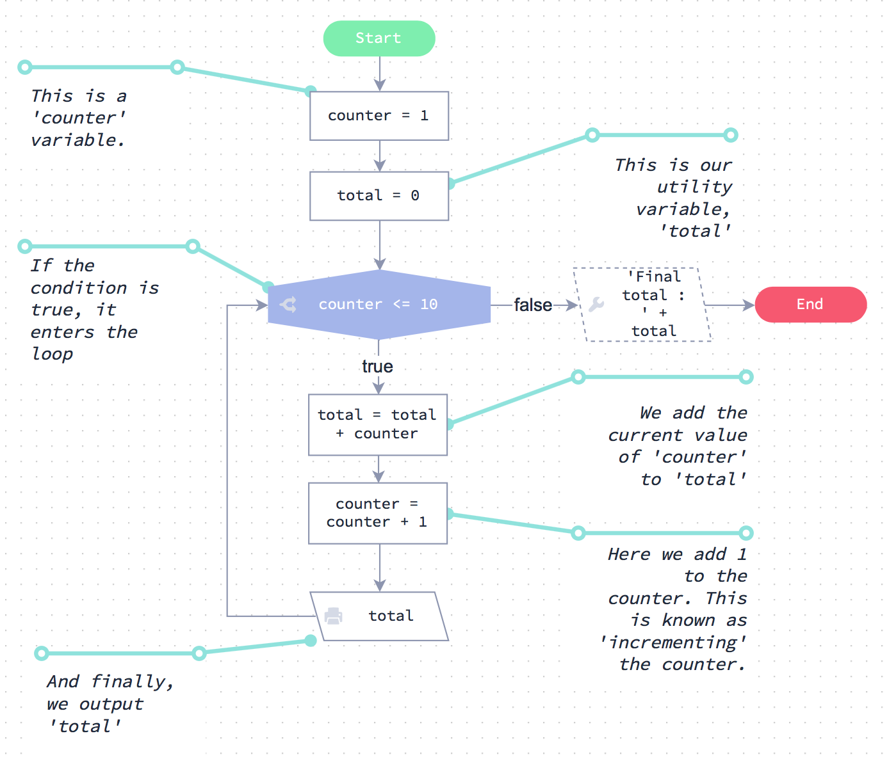

# Variables de utilidad

Hemos descubierto variables de utilidad antes, dentro de nuestras unidades Flode.

**Resumen**

Muy a menudo en un bucle, necesitará actualizar un valor con cada \* iteración \* de su bucle. Al final del bucle es posible que desee hacer algo con ese valor.

A la izquierda hay un buen ejemplo de esto mostrado en un gráfico de Flode. El gráfico de Flode está haciendo lo siguiente:

> Sumar todos los valores entre 0 y 10 y dar output al resultado.

Pase a través de la tabla y observe con cuidado la variable llamada `total`. Puede ver que la variable `total` se actualiza cada vez que pasamos por el bucle. Una vez que el bucle está terminado, emitimos el `total` que ha estado aumentando con cada \* iteración \* del bucle.

Una serie de desafíos que siguen requieren que utilice esta técnica, así que asegúrese de que usted lo entiende.


 

## Código equivalente

A la izquierda está el código JavaScript equivalente al gráfico de Flode de la página anterior.

Si ejecuta el código, verá que se ocupa del bucle exactamente de la misma manera que el gráfico de Flode.

```js

var counter = 1                 // Esta es una variable 'counter'.
var total = 0                   // Esta es nuestra variable de utilidad, 'total'

while (counter <= 10) {         // Si la condición es verdadera, entra en el bucle
  total = total + counter         // Añadimos el valor actual de 'contador' a 'total'
  counter = counter + 1       // Aquí agregamos 1 al contador. Esto se conoce como
                               // 'incrementar' el contador.
  console.log (total)             // Y finalmente, la salida 'total'
}


```

[EJECUTE EL CÓDIGO] ()

 

