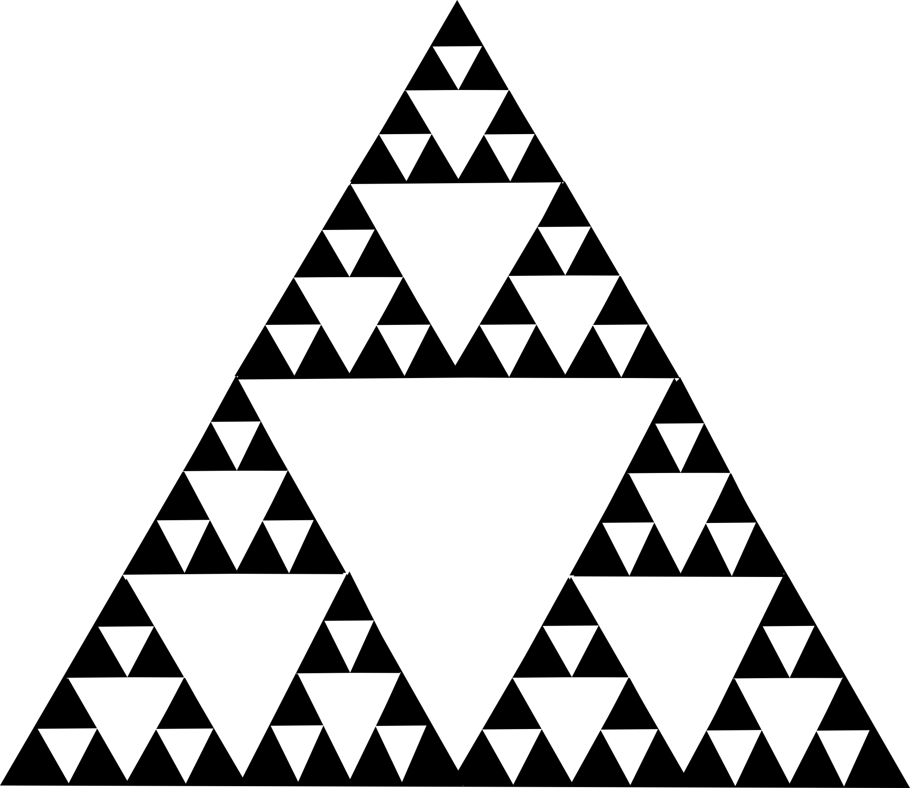
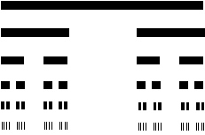

# Workshop - Ejercicio Resueltos
- Formato: `workshop`
- Duración: `90min`

## Objetivos

- Practicar codeando junto a tu equipo de profes, resolviendo problemas de estructuras condicionales, repetitivas y funciones
- Practicar, practicar y practicar

#### Dado 3 números(N1,N2,N3) calcular el Máximo y Mínimo Valor. Sin usar ciclos.

```js
// 	Entrada	 : N1 = 10, N2 = 30, N3 = 5 
// 	Salida	 : Máximo = 30, Mínimo = 5 

var n1 = 10;
var n2 = 30;
var n3 = 5;
var maximo = 0;
var minimo = 0;
if(n1 > n2)
{
    if(n1 > n3)
    {
        maximo = n1;
        if(n2 > n3){
            minimo = n3;
        }
        else{
            minimo = n2;
        }
    }
    else
    {
        maximo = n3;
        minimo = n2;
    }
}
else
{
    if(n2 > n3)
    {
        maximo = n2;
        if(num1 > n3){
            minimo = n3;
        }
        else{
            minimo = n1;
        }
    }
    else
    {
        maximo = n3;
        minimo = n1;
    }
    
}
console.log("Máximo = " + maximo + ", Mínimo = " + minimo);
```
 
#### Elementos en posicion par e impar


```js
// Entrada: A = [15,  29, 78, 29, 40, 20, 18, 100, 78, 68] 
// Salida: Elementos de posición par : 15 78 40 18 78 
//         Elementos de posición impar : 29 29 20 100 68 

var a = [15,  29, 78, 29, 40, 20, 18, 100, 78, 68];
var pares;
var impares;
for(var i = 0; i < arregloD.length; i++){
    if(i % 2 == 0){
      pares+=a[i];
    }
    else{
      impares+=a[i];
    }
  }
  console.log("Elementos de posición par: " + arrPares) 
  console.log("Elementos de posición Impar: " + arrImpares);
```
 
 
#### Invertir el order en un array 

```js 
// EJERCICIO 3
//   Dado un arreglo A, cómo invertiría su orden?. 
//   Entrada : A = [1 2 3 4 5 6 7 8 9 0] 
//   Salida  : 0 9 8 7  6 5 4 3 2 1 


var arr = [1, 2, 3, 4, 5, 6, 7, 8, 9, 0];
var arrInvertido=[];
for( var i=arr.length-1;i>=0;i--){
  arrInvertido+=arr[i];
}
console.log(arrInvertido);
```
#### Imprimir un Triangulo de Números (versión 1)

```js 
// FIGURA 2
// "1   "
// "121  "
// "12321 "
// "1234321"
function espacios(n) {
  var s = "";
  for (var i = 0; i < n; i++) 
    s += " ";
  return s;
}
function quiz2(n) {
  for (var i = 0; i < n; i++) {
    var s = "";
    for (var j = 1; j <= i + 1; j++) {
      s += j;
    }
    var e = espacios (n - (i+1));
    for (var j = i; j >= 1; j--) {
      s += j;
    }
    console.log(s+e);
  }
}
quiz2(4);
``` 

#### Imprimir un Triangulo de Números (versión 2)

```js 
// si n = 4, entonces
// FIGURA 1
// "   1"
// "  121"
// " 12321"
// "1234321"

//Esta función me permite pintar espacios
function espacios(n) {
  var s = "";
  for (var i = 0; i < n; i++) s += " ";
  return s;
}
function quiz1(n) {
  for (var i = 0; i < n; i++) {
    var s = "";
    for (var j = 1; j <= i + 1; j++) {
      s += j;
    }
    var e = espacios (n - (i+1));
    for (var j = i; j >= 1; j--) {
      s += j;
    }
    console.log(e + s);
  }
}
quiz1(4) 
```

#### Dibujar dos Semitriangulos
```js 
// FIGURA 3
// "1"
// "12"
// "123"
// "1234"
// "12345"
// "     54321"
// "     4321"
// "     321"
// "     21"
// "     1"
function quiz3(n) {
  for (var i = 0; i < n; i++) {
    var s = "";
    for (var j = 1; j <= i + 1; j++) {
      s += j;
    }
    console.log(s);
  }
  var e = espacios(n);
  for (var i = 0; i < n; i++) {
      var s = "";
      for (var j = n - i; j >= 1; j--) {
        s += j;
      }
      console.log(e + s);
  }  
}
quiz3(4);
```

#### Dibujar un Rombo

Una  función  Dibuja,  que  teniendo  como  parámetro  un  entero  positivo  (N)  nos imprima en la consola un rombo, tal como se aprecia en el ejemplo adjunto.

```js 
// Ejemplo:
// Si el número fuese 5 se imprime:
      //     1
      //    123
      //   12345
      //  1234567
      // 123456789
      //  1234567
      //   12345
      //    123
      //     1
function espacios (n)
{
  var s = "";
  for (var i = 0; i < n; i++)
   s += " ";
  return s;
}
function Dibujar(n) {

    for (var k = 0; k < 2 * n - 1; k++) {
      var i = k < n ? k :  2*n - 2 - k;
      var content = "";
      for (j = 1; j <= 2*i+1; j++){
        content +=  j;
      var sp = espacios (n - (i+1));
      }
      console.log(sp + content);
    }
}

Dibujar(5);
```
#### Dibujar un circulo 

```js 
//              ****
//        ****************
//      ********************
//    ************************
//  ****************************
//  ****************************
//  ****************************
//********************************
//********************************
//  ****************************
//  ****************************
//  ****************************
//    ************************
//      ********************
//        ****************
//              ****
function quiz4 (r) {
    var x = 0;
    var circulo = [];
    var espacios = [];
    while (x <= r) {
        var y = Math.sqrt ( r * r - x*x);
        x++;
        var j = 0;
        var str = "";
        while ( j <= y) {
            str += "**";
            j++;
        }
        var e = "";
        for (var i = 0; i < r - y; i++) {
            e += "  ";
        }
        circulo.push(str);
        espacios.push (e);
    }
    for (var i = espacios.length -1; i >=0 ; i--) {
        console.log (espacios[i] + circulo[i] + circulo[i] );
    }
    for (var i = 0; i < circulo.length; i++) {
        console.log (espacios[i] + circulo[i] + circulo[i] );
    }
}
quiz4(7);
```


#### Capicua. Crear una función que me diga si un número es capicúa o no.
Nota:un número capicúa es aquel que se lee igual de izquierda a derecha, como de derecha a izquierda
 
```js
//Ejemplos:  112211, 565, 1234554321
//La entrada es tipo numérico.

function capicua(num)
{
    num = num.toString();
    var numTexto = num;
    num = num.split("").reverse().join("");
    if(numTexto == num)
    {
        return numTexto + " es capicua";
    }
    else
    {
        return numTexto + " no es capicua";    
    }
}
```

#### Crear una función que me permita calcular la potencia de un número N elevado a la M (ejemplo NM). Nota No usar funciones de Math.
```js
// 
// Entrada N=2; M=3;
// Salida 8

function potencia(a, n)
{
    var p = 1;
    for (var i = 0; i < n; i++)
        p *= a;
    return p;
}
console.log(potencia(2, 3));
```

#### Crear una función que dado un arreglo de String A me permita contar cuantas veces se repite un caracter C en dicho arreglo.
```js

// Entrada: A=[“murcielago”, “pato”,”caballo”, “zebra”]; C=”a”;
//Salida: 5;

function cantidadCaracter(arreglo, caracter)
{
    var cont = 0;
    for(var i in arreglo)
    {
        for(var j in arreglo[i])
        {
            if(arreglo[i][j] == caracter)
            {
                cont++;
            }             
        }
    }   
    return cont;
}
```

#### Escriba una función que cuente cuántas palabras hay una cadena de texto

```js
/*
Entrada : A=”El mundo es tan cruel”;
Salida : 5
*/
function cantidadPalabras(cadena)
{
    cadena = cadena.split(" ");
    return cadena.length;
}
```

#### Escriba una función que dado un arreglo A de string me dé como resultado el tamaño más largo de todas las palabras.

```js
/*
Entrada : A=[“gato”,”Perro”,”Cocodrilo”,”leon”];
Resultado: 9
*/

function largo(arreglo)
{
    var mayor = 0;
    for(var i in arreglo)
    {
        if(arreglo[i].length > mayor)
            mayor = arreglo[i].length;
    }
    return mayor;
}
```
#### Escriba una función que dado un arreglo A de string me calcule cuántas vocales hay en todo el arreglo. 

```js
/*
Entrada : A=[“ojo”,”mouse”,”lapiz”];
Salida: 7
*/

function cantVocales(arreglo)
{
    var vocales = ["a", "e", "i", "o", "u", "á", "é", "í", "ó", "ú"]
    var cont = 0;
    for(var i in arreglo)
    {
        for(var j in arreglo[i])
        {
            for(var k in vocales)
            {
                if(arreglo[i][j].toLowerCase() == vocales[k])
                {
                    cont++;
                }
            }
        }
    }
    return cont;
}
```
#### Escriba una función que calcule la sumatoria de todos los números impares comprendidos entre los números N y M

```js
/*
Entrada: N=1; M=7
Salida: 16
*/
function sumaImpares(num1, num2)
{
    var suma = 0;
    for(var i = num1; i <= num2; i++)
    {
        if(i % 2 == 1)
        {
            suma += i;
        }
    }
    return suma;
}
```
#### Escriba una función que dado un arreglo de string devuelva la palabra mas larga Entrada

```js
/*
A=[“jirafa”,”leon”,”gato”,”murcielago”,”rata”]
Salida “murcielago”
*/
function palabraLarga(arreglo)
{
    var mayor = 0;
    var palabra = "";
    for(var i in arreglo)
    {
        if(arreglo[i].length > mayor)
        {
            mayor = arreglo[i].length;
            palabra = arreglo[i];
        }
    }
    return palabra;
}
```
####  Escriba una función que dado un numero N. Generar la siguiente figura:

```js
/*
Entrada: N = 4
Salida: ____/''''\___/'''\__/'''\_/'\
*/

function figura(num)
{
    var figura = "";
    for(var i = 0; i < num; i++)
    {
        for(var j = 0; j < num - i; j++)
        {
            figura += "_"
        }
        figura += "/"
        for(var j = 0; j < num - i; j++)
        {
            figura += "'"
        }
        figura += "\\";
    }
    return figura;
}
```


#### Fractales. Triangulo de serpinski
js
```
function espacios(n) {
  var s = "";
  for (var i = 0; i < n; i++) s += " ";
  return s;
}

function parte1(n) {
  for (var i = 0; i < n; i++) {
    var s = "";
    for (var j = 1; j <= i + 1; j++) {
       s += '*';
    }
    var e = espacios (n+(n - (i+1)));
    var e1= espacios (n);
    for (var j = i; j >= 1; j--) {
       s += '*';
    }
    console.log(e + e1 + e1 + s);
  }
}
function parte2(n) {
  for (var i = 0; i < n; i++) {
    var s = "";
    for (var j = 1; j <= i + 1; j++) {
       s += '*';
    }
    var e = espacios ((n - (i+1)));
    var e1= espacios(n);
    for (var j = i; j >= 1; j--) {
       s += '*';
    }
    console.log(e1+ e1 +e + s + e + e +s);
  }
}
function parte3(n) {
  for (var i = 0; i < n; i++) {
    var s = "";
    for (var j = 1; j <= i + 1; j++) {
       s += '*';
    }
    var e = espacios (n+(n - (i+1)));
    var e1= espacios (n);
    for (var j = i; j >= 1; j--) {
       s += '*';
    }
    console.log(e + s + e + e + s);
  }
}
function parte4(n) {
  for (var i = 0; i < n; i++) {
    var s = "";
    for (var j = 1; j <= i + 1; j++) {
       s += '*';
    }
    var e = espacios ((n - (i+1)));
    var e1= espacios(n);
    for (var j = i; j >= 1; j--) {
       s += '*';
    }
    console.log(e + s + e + e + s + e + e + s + e + e + s);
  }
}

parte1(5)
parte2(5)
parte3(5)
parte4(5)
```


#### Fractales. Conjunto de Cantor 




