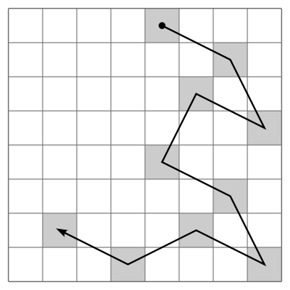
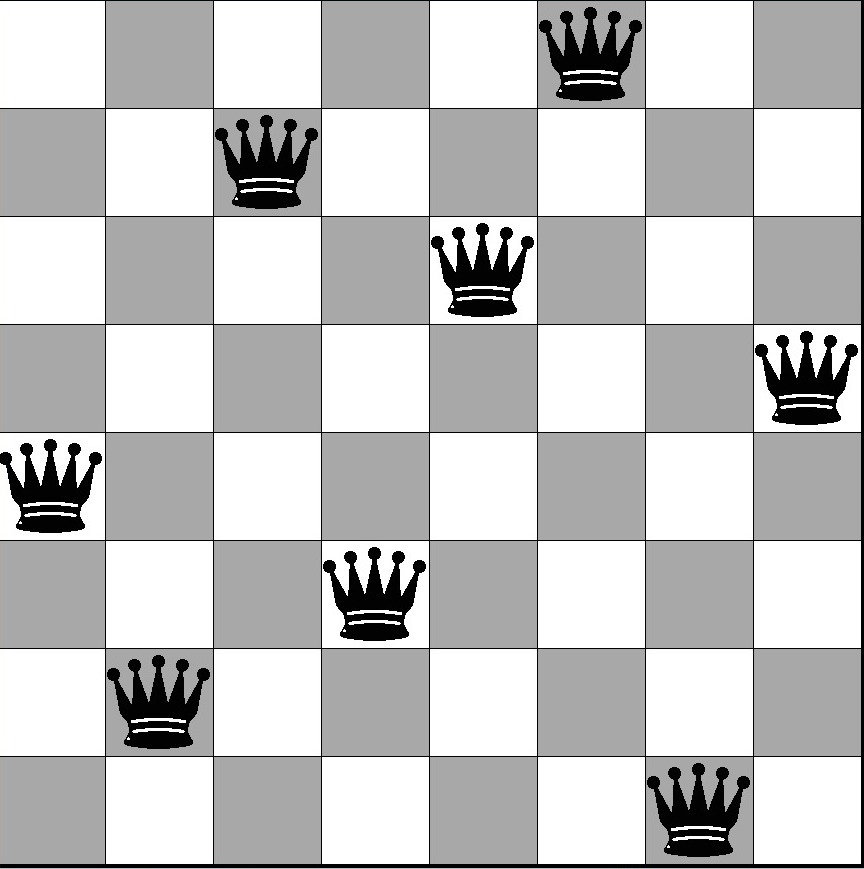

### Proyecto: Ahorcado
El ahorcado (también llamado colgado) es un juego de adivinanzas de lápiz y papel para dos o más jugadores. Un jugador piensa en una palabra, frase u oración y el otro trata de adivinarla según lo que sugiere por letras o números.

### Proyecto: Reserva de pasajes en un bus

### Proyecto:  Problema del caballo

### Proyecto:  Problema N Reinas

#### Problema del Laberinto 

