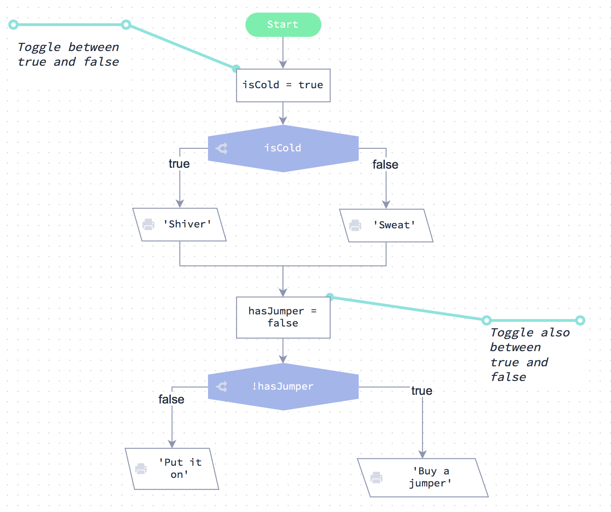

## 4. Booleano

Ha utilizado valores booleanos antes en Flode. Para recordarle, a la izquierda está el gráfico de Flode con el que trabajó anteriormente.



En un bloque Flode, puede utilizar cualquiera de los siguientes:

```text
esFrio = true
esFrio = false
```

Mire el gráfico de Flode a la izquierda. Puede ver que el gráfico toma una decisión basada en la variable booleana mostrada anteriormente.

¿La condición de decisión es `esFrio`? También podríamos escribirlo así y se comportaría exactamente de la misma manera:

```text
esFrio = true
```

No
---

Ahora mire la segunda decisión. La expresión `!tieneJumper` puede leerse como '**no** tiene Jumper '.

Tenga en cuenta el carácter `!` Antes de `tieneJumper`. Esto significa 'no'.

También podríamos haberlo escrito así:

```text
tieneJumper = false
```

... y el resultado sería el mismo. Sin embargo, mezclar sus comparaciones `true` y` false` puede ser confuso. Es más legible hacer todas sus comparaciones "verdaderas" si es posible.

Jugar con el gráfico
--------------------

Pase a través de la tabla. Siéntase libre de experimentar y cambiar los valores de `esFrio` y` tieneJumper` y seguir con el flujo de ejecución para asegurarse de que se entiende.

En las siguientes páginas hay algunos retos para reforzar su comprensión de los conceptos booleanos.

## 4.1. Código equivalente


```js

var esFrio = false          // Cambia entre verdadero y falso

if (esFrio) {
  console.log ('tiemblo')
}
else {
  console.log ('Sudo')
}

var tieneJumper = true     // Cambia también entre true y false
if ( !tieneJumper) {
  console.log ('Comprar un Jumper')
}
else {
  console.log ('Ponermelo')
}
```

## 4.2. Retornar un booleano simple

Le proporcionamos un número, N.

Si N es mayor o igual a 100, genera un booleano verdadero, de lo contrario falso.

```js

// Obtener argumentos de la línea de comandos
// Asegúrese de que sean tratados como números
var N = 19 // prompt("input: ")

// Su código va aquí

```

[¡Revisalo!]()

## 4.3. Inputs (entradas) booleanas

Pasamos en 2 entradas booleanas, Frío y Lluvioso.

Debería generar una sola cadena:
`('Frío' o 'caliente') 'y' ('lluvioso' o 'seco')`
Basado en estos inputs.

`('Frío' o 'caliente')` significa que debe usar una de las dos palabras, dependiendo del valor booleano de entrada (input).

Por ejemplo, falso, verdadero = ‘cálido y lluvioso’

```js

// Obtener entrada desde la línea de comandos
Var isCold =true // prompt("input: ")
Var isRainy = false // prompt("input: ")

// Su código va aquí


```

[¡Revisalo!]()
