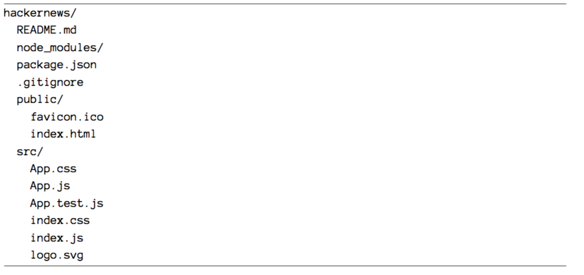

# Instalación

Existen múltiples enfoques para comenzar con una aplicación React.

La primera es utilizar una CDN.   Una CDN es una red de contenidos. Varias compañías tienen CDNs que alojan archivos públicamente para los usuarios. Estos archivos pueden ser bibliotecas como React. Después de todo, una biblioteca puede ser sólo un archivo JavaScript. Puede ser alojado en cualquier lugar y puede ser requerido en su aplicación.

¿Cómo usar una CDN para comenzar con React?  

```js
<script src="https://unpkg.com/react@15/dist/react.js"></script>
<script src="https://unpkg.com/react-dom@15/dist/react-dom.js"></script>
```


Cuando su aplicación tiene un archivo package. json, puede instalar react and react-dom desde la línea de comandos. El requisito es que la carpeta se inicialice como proyecto npm con un archivo package. json. Puede instalar varios paquetes de node  en una línea con npm.

`npm install --save react react-dom`

Desafortunadamente eso no es todo. Tendrías que utilizar tambien  Babel para que tu aplicación conozca JSX - la sintaxis React - y JavaScript ES6. Babel transpira tu código que los navegadores pueden interpretar en ES6 y JSX. No todos los navegadores son capaces de interpretar la sintaxis. La instalación incluye mucha configuración y herramientas. Puede ser abrumador para los principiantes de React para molestarse con toda la configuración.

Por esta razón, Facebook introdujo `create-react-app` como una solución React de configuración cero. El siguiente capítulo le mostrará cómo configurar su aplicación.

Para empezar, tendrá que instalar el paquete en sus paquetes de nodo global. Después de eso, siempre estará disponible en la línea de comandos para iniciar nuevas aplicaciones React.

`npm install -g create-react-app`

Ahora puede iniciar su primera aplicación React. Lo llamamos hackernews, pero puedes elegir un nombre diferente. A continuación, simplemente navegue hasta la carpeta:

`create-react-app hackernews`
`cd hackernews`

Ahora puede abrir la aplicación en su editor. Se le debe presentar la siguiente estructura de carpetas, o una variante de la misma según la versión create-react-app:
 
 

Al principio todo lo que necesita se encuentra en la carpeta src/.

El esquema principal está en el archivo `src/App.js` para implementar componentes React. Este archivo se usará para implementar su aplicación, pero más adelante puede que desee dividir sus componentes en múltiples archivos.

Además, encontrará un archivo `src/App.test.js` para pruebas y un `src/index.js` como punto de entrada al mundo React. Conocerá ambos archivos en un capítulo posterior. Además, hay un archivo `src/index.css` y un archivo `src/App.css` para dar estilo a su aplicación y componentes. Todos ellos vienen con el estilo predeterminado cuando los abres.

Junto a la carpeta `src/` encontrará el archivo `package.json` y la carpeta `node_modules/` para administrar sus paquetes. La aplicación `create-react-app` es un proyecto `npm`. Puede usar `npm` para instalar y desinstalar paquetes en su proyecto.

El proyecto `create-react-app` viene con los siguientes scripts npm para su línea de comandos:

// Runs the application in http://localhost:3000
`npm start`

// Runs the tests
`npm test`

// Builds the application for production
`npm run build`

Los scripts están definidos en su `paquage.json`.


