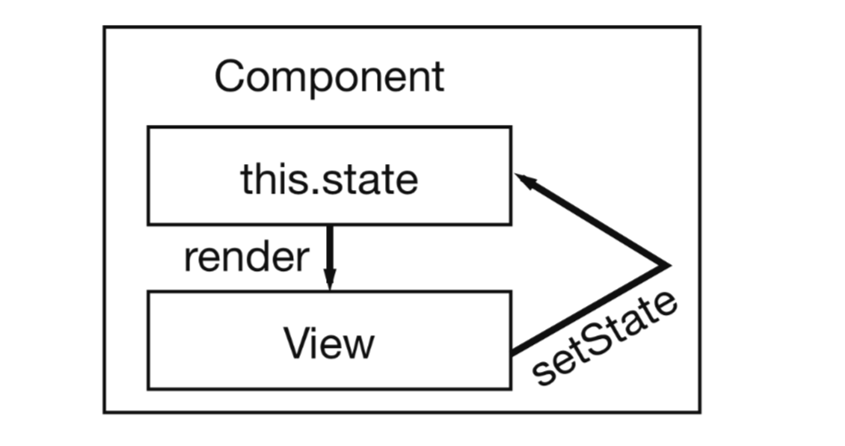

# Flujo unidireccional de datos

Ahora sabes inicializar un estado interno de un componente. Sin embargo, aún no han manipulado el estado interno.  Una buena manera de experimentar la manipulación del estado es tener alguna interacción de componentes.

Añadamos un botón para cada elemento de la lista desplegada. El botón "Dismiss" eliminará el elemento de la lista. Podría ser útil eventualmente cuando sólo quiera mantener una lista de artículos no leídos.

```js
class App extends Component {
   //...
   render() {
      return (
         <div className="App">
            {this.state.list.map(item => (
               <div key={item.objectID}>
                  <span>
                     <a href={item.url}>{item.title}</a>
                  </span>
                  <span>{item.author}</span> <span>{item.num_comments}</span>{" "}
                  <span>{item.points}</span>{" "}
                  <span>
                     <button
                        onClick={() => this.onDismiss(item.objectID)}
                        type="button"
                     >
                        {" "}
                        Dismiss
                     </button>
                  </span>
               </div>
            ))}
         </div>
      );
   }
}
```

Como se puede ver, el método `onDismiss ()` en la función `onClick` viene incluido por otra función. Sólo así se puede introducir la propiedad objectID. De lo contrario, tendría que definir la función en el exterior. Sin embargo, utilizando una función de flecha ES6 se puede hacer mas simple.

Tenga en cuenta que los elementos con múltiples atributos se confunden como una línea en algún momento. Por eso, el elemento de botón ya se utiliza con multilíneas e indentación para mantenerlo legible. Pero no es obligatorio. Es sólo una recomendación de estilo de código.


```js
class App extends Component {
   constructor(props) {
      super(props);
      this.state = {
         list
      };
   }
   onDismiss(id) {
      //...
   }
   render() {
      //...
   }
}
```
Ahora puede definir lo que sucede dentro del método de clase. Dado que desea eliminar el elemento que ha hecho clic en la lista, puede hacerlo con la función de filtro de matrices integrada. La función `.filter` tiene una función para evaluar cada posición de la lista. Si la evaluación de una posición es verdadera, la posición permanece en la lista. De lo contrario, será removido. Además, la función devuelve una nueva lista y no cambia la lista antigua. Mantiene la estructura inmutable de los datos.

```js
onDismiss(id) {
  function isNotId(item) {
    return item.objectID !== id;
  }
  const updatedList = this.state.list.filter(isNotId);
}
```
Puede hacerlo de forma más concisa utilizando de nuevo una función de flecha ES6.

```js
onDismiss(id) {
  const isNotId = item => item.objectID !== id;
  const updatedList = this.state.list.filter(isNotId);
}
```

La lista elimina el elemento que se ha hecho clic. Sin embargo, el estado aún no está actualizado. Por lo tanto, puede utilizar finalmente el método de clase `setState ()` para actualizar la lista en el estado de componente interno.

```js
onDismiss(id) {
    const isNotId = item => item.objectID !== id;
    const updatedList = this.state.list.filter(isNotId); 
    this.setState({ list: updatedList });
}
```
Ahora vuelva a ejecutar su aplicación e intente el botón "onDismiss". Debería funcionar. Lo que usted experimenta ahora es el flujo de datos unidireccional en React. Usted desencadena una acción en su vista - `onClick ()` - una función o método de clase modifica el estado interno del componente y el método render () del componente se ejecuta de nuevo para actualizar la vista.



