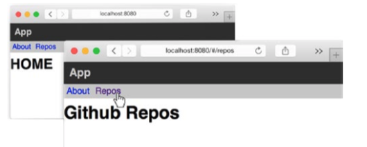

# Routing

La URL es una ventaja importante que la Web tiene sobre las aplicaciones nativas. Nació como simple apuntador de un documento en un servidor, pero en aplicaciones web la mejor forma de verlo es como la representación del estado actual de las aplicaciones. Mirando la URL el usuario puede entender la parte de la aplicación donde se encuentra actualmente, pero también puede copiarla para su uso posterior o pasarla. 

## Implementar enrutamiento  de una manera simple

Para entender cómo funciona el enrutamiento básico, así como las complicaciones que surgen rápidamente en escenarios un poco más grandes que la navegación básica no anidada, comencemos implementando un componente simple que, dependiendo de la URL actual, rinda un componente hijo diferente. Creará una aplicación que utilizará la API de GitHub para devolver la lista de repositorios para el usuario pro Rect. Además de esta sección de "repositorios", la aplicación también tendrá una página de inicio y una sección de "Acerca de". Concentrémonos en el componente principal y el código de ruta, mostrado en Listing 5-1.

```js
//Listing 5-1. A Component that render child components based on the URL
import React, { Component } from 'react';
import { render } from 'react-dom';

import About from './About';
import Home from './Home';
import Repos from './Repos';
class App extends Component {
   constructor(props) {
      super(props);
      this.state = {
         route: window.location.hash.substr(1)
      };
   }
   componentDidMount() {
      window.addEventListener('hashchange', () => {
         this.setState({
            route: window.location.hash.substr(1)
         });
      });
   }
   render() {
      ///...
   }
}
render(<App />, document.getElementById('root'));

````

El código es bastante sencillo. En el constructor de componentes, obtendrá la ubicación hash actual de la URL y la asignará al estado de ruta. Por razones de simplicidad, por el momento no estará tratando con HTML5 URL History API. A continuación, cuando el componente se monta, agrega un receptor de eventos, de modo que cada vez que la URL cambie, el estado de la ruta se actualizará y el componente volverá a renderizarse. Hablando de renderizado, todo lo que necesitas hacer en el método de renderizado es usar el componente apropiado basado en la ruta actual,

```js
render() {
      var Child;
      switch (this.state.route) {
         case '/about':
            Child = About;
            break;
         case '/repos':
            Child = Repos;
            break;
         default:
            Child = Home;
      }
      return (
         <div>
            <header>App</header>{' '}
            <menu>
               <ul>
                  <li>
                     <a href="#/about">About</a>
                  </li>{' '}
                  <li>
                     <a href="#/repos">Repos</a>
                  </li>
               </ul>{' '}
            </menu>
            <Child />{' '}
         </div>
      );
   }
```
En este sencillo ejemplo, todos los componentes hijo que representan páginas de navegación internas tienen la misma estructura (pero con diferentes encabezados)

```js
//Listing 5-3. The Home Component
import React, { Component } from 'react';
class Home extends Component {
   render() {
      return <h1>HOME</h1>;
   }
}
export default Home;
```

```js
//Listing 5-4. The About Component
import React, { Component } from 'react';
class About extends Component {
   render() {
      return <h1>ABOUT</h1>;
   }
}
export default About;
```

```js
//Listing 5-5. The Repos Component
import React, { Component } from 'react';
class Repos extends Component {
   render() {
      return <h1>Github Repos</h1>;
   }
}
export default Repos;
```

El sistema de enrutamiento ya funciona, y si pones un poco de estilo, puede parecerse a la Figura. 

 

Aunque funciona para este caso de ejemplo, hay al menos dos preocupaciones con este enfoque, uno más conceptual y otro más práctico:

* En esta implementación de ejemplo, el mantenimiento de URLs ha ocupado un lugar central: en lugar de actualizar automáticamente la URL mientras la aplicación fluye programáticamente, usted está escuchando y manipulando directamente la URL para que la aplicación llegue a un estado diferente.
* El código de enrutamiento puede crecer exponencialmente en complejidad en escenarios no triviales. Imagine por ejemplo que dentro de la página Repos puede ver una lista de reposiciones para el usuario pro React en GitHub, con rutas internas para los detalles del repositorio, algo así como /repos/repo/repo_id (como se ilustra en la Figura 5-2).
* Tendrías que hacer tu URL analizando mucho más inteligentemente, y terminar con un montón de código para averiguar qué rama de componentes anidados se renderizarán en cualquier URL dada.

## React Router 

React Router es la solución más popular para agregar enrutamiento a una aplicación React. Mantiene la interfaz de usuario sincronizada con la URL al tener componentes asociados a rutas (en cualquier nivel de anidamiento). Cuando el usuario cambia la URL, los componentes se desmontan y montan automáticamente. Otra ventaja de la librería React Router es que proporciona mecanismos para que usted pueda controlar el flujo de su aplicación sin diferentes puntos de entrada dependiendo de si el usuario ingresó a un estado programáticamente o pulsando una nueva URL: el código que se ejecuta en cualquier caso es el mismo.
Dado que el router React Router es una biblioteca externa, debe instalarse con npm (junto con la biblioteca Historial, que es una dependencia de pares del router React). Para instalar la versión 1 de ambas bibliotecas, use `npm install --save react-router@1.x.x history@1.x.x.`

React Router proporciona tres componentes para empezar:

* Router and Route: Se utiliza para asignar las rutas declarativamente a la jerarquía de pantalla de su aplicación.
* Enlace: Se utiliza para crear una etiqueta de anclaje totalmente accesible con la referencia de referencia correcta. Por supuesto, esta no es la única forma de navegar por el proyecto, pero normalmente es la forma principal con la que el usuario final interactuará.

Cambiemos el primer ejemplo de una implementación "ingenua" a usar el enrutador React Router. Una vez instalado, empiece por realizar las importaciones apropiadas en el componente App, como se muestra en Listado 5-7.

```js
//Listing 5-7. Importing the React Router Components import React, { Component } from 'react';
import { render } from 'react-dom'; // first we import some components
import { Router, Route, Link } from 'react-router';
import About from './About'; import Home from './Home'; import Repos from './Repos';

class App extends Component {
	//...
}
```

Dentro de la clase, puede deshacerse de los métodos constructor y componentDidMount que utilizó para administrar el análisis de URL y la escucha de eventos; esto se tendrá en cuenta automáticamente ahora. Dentro del método de renderizado, también puede deshacerse de la secuencia de interruptores; el enrutador React Router ajustará automáticamente los puntales infantiles al componente que sea apropiado según la ruta actual. Tenga en cuenta, también, que necesita reemplazar <a> etiquetas para <Link> componentes para generar los enlaces de navegación adecuados. El listado 5-8 muestra la clase actualizada del componente App.

```js
// Listing 5-8. Updated App Component Class

class App extends Component {
   render() {
      return (
         <div>
            <header>App</header>{' '}
            <menu>
               <ul>
                  <li>
                     <Link to="/about">About</Link>
                  </li>{' '}
                  <li>
                     <Link to="/repos">Repos</Link>
                  </li>
               </ul>{' '}
            </menu>
            {this.props.children}{' '}
         </div>
      );
   }
}
```

Finalmente, necesita declarar sus rutas. Haga esto al final del fichero. En lugar de renderizar el componente App al DOM, se pasa el componente Router con algunas rutas al método de renderizado React DOM, tal y como se muestra en Listing 5-9.

```js
// Listing 5-9. The Updated Render
render(
   <Router>
      <Route path="/" component={App}>
         <Route path="about" component={About} />{' '}
         <Route path="repos" component={Repos} />
      </Route>{' '}
   </Router>,
   document.getElementById('root')
);
```

El código completo del archivo App. js se muestra en Listado 5-10.

```js

//Listing 5-10. The Complete Code with React Router import React, { Component } from 'react';
import { render } from 'react-dom';
import { Router, Route, Link } from 'react-router';
import About from './About';
import Repos from './Repos';
import Home from './Home';
class App extends Component {
   render() {
      return (
         <div>
            <header>App</header>{' '}
            <menu>
               <ul>
                  <li>
                     <Link to="/about">About</Link>
                  </li>{' '}
                  <li>
                     <Link to="/repos">Repos</Link>
                  </li>
               </ul>{' '}
            </menu>
            {this.props.children}{' '}
         </div>
      );
   }
}
render(
   <Router>
      <Route path="/" component={App}>
         <Route path="about" component={About} />{' '}
         <Route path="repos" component={Repos} />
      </Route>{' '}
   </Router>,
   document.getElementById('root')
);
```

 Consejo llamado Componentes: por lo general una ruta tiene un solo componente, que se hace disponible a través de este. puntales. en el componente superior. también es posible declarar uno o más componentes nombrados al configurar la ruta. en este caso, los componentes se pondrán a disposición de sus padres por nombre en los puntales. ejemplo:

```js
React.render((
 <Router>
  <Route path="/" component={App}>
   <Route path="groups" components={{content: Groups, sidebar: GroupsSidebar}}/>
   <Route path="users" components={{content: Users, sidebar: UsersSidebar}}/>
  </Route>
 </Router>
), element);

// then, in the component:

render() {
 return (
  <div>
   {this.props.children.sidebar}-{this.props.children.content}
  </div>
); }

```

