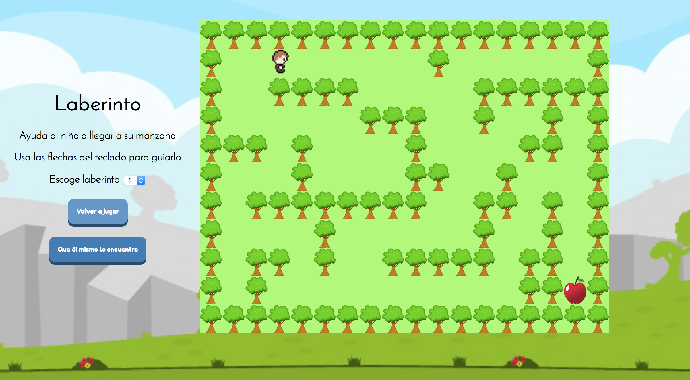

Al igual que hemos hecho antes, es hora de aplicar los conceptos aprendidos para resolver problemas.

A continuación tendrás varios problemas que debemos resolver. Intenta resolverlos primero por tu cuenta. Más abajo encontrarás las soluciones de del problema. Después de haberlo intentado, compara tus soluciones con las del **##repositorio oficial##**.

## 1. El Ahorcado

Crea una página web que implemente el juego del Ahorcado. El ahorcado es un divertido juego de adivinanzas para dos jugadores (Computador vs Jugador). La idea de la horca puede ser un poco mórbida, pero también aumenta la emoción del juego. ¡Todo el mundo quiere salvar a la pobre persona de un sombrío destino!
> Jugador 1 -> El computador    /     Jugador 2 -> El adivinador

El jugador 1 piensa en una palabra y el otro trata de adivinarla según lo que sugiere. Si el jugador 2 sugiere una letra que aparece en la palabra, el jugador 1 la escribe en todas sus posiciones correctas. Si la letra sugerida no aparece en la palabra, el jugador 1 dibuja un elemento de la figura del hombre ahorcado como una marca de conteo, descotando 1 a 1 de tus 14 intentos. El juego termina cuando:

1. El jugador adivinador completa la palabra, o adivina la palabra completa correctamente
2. El otro jugador (el computador) completa de dibujar al ahorcado.


### Ejemplo de juego 

El siguiente ejemplo del juego ilustra un jugador tratando de adivinar la palabra `AHORCADO` utilizando una estrategia basada únicamente en la frecuencia de letra.


¡El jugador gana!, pues descubrió la palabra secreta, AHORCADO.

### Tips para la solución

A continuación, encontrarás tips que podrían ayudarte con la solución, mucha suerte!

#### [Tip 1. | Arte ASCII ]
Los gráficos para el Ahorcado son caracteres del teclado impresos en la pantalla. Este tipo de
gráficos se llama arte ASCII (se pronuncia “asqui”), y fue una especie de precursor a emojii.  

```js 
var figure = [
   '+------------+      ',
   '|            |      ',
   '|           / \\    ',
   '|           \\ /    ',
   '|            |      ',
   '|           /|\\    ',
   '|          / | \\   ',
   '|         /  |  \\  ',
   '|            |      ',
   '|           / \\    ',
   '|          /   \\   ',
   '|         /     \\  ',
   '+------------------+',
   '|//////////////////|'
];
```

#### [Tip 2. | Flujo del programa ]

Este juego es un poquito más complicado de lo que parece, de modo que tómate un momento para pensar cómo implementarlo. Primero necesitarás crear un diagrama de flujo  para ayudar a visualizar lo que este programa hará.  
Un diagrama de flujo es un diagrama que muestra una serie de pasos como recuadros conectados por flechas. Cada recuadro representa un paso, y las flechas muestran qué pasos llevan a qué otros pasos. Coloca tu dedo sobre el recuadro "Inicio" del diagrama de flujo y recorre el programa siguiendo las flechas a los otros recuadros hasta que llegues al recuadro “Fin”.


La Figura anterior es un diagrama de flujo completo para el Ahorcado. Sólo puedes moverte de un recuadro a otro en la dirección de la flecha. Nunca puedes volver hacia atrás a menos que haya una segunda flecha apuntando en dirección opuesta, como en el recuadro “El jugador ya ha probado esa letra”.

¡Eso se ve bien! Este diagrama de flujo reproduce completamente todo lo que puede ocurrir en el Ahorcado y en qué orden. Cuando diseñes tus propios juegos, un diagrama de flujo puede ayudarte a recordar todo lo que necesitas codificar.

Por supuesto, no es estrictamente necesario que hagas un diagrama de flujo. Podrías simplemente comenzar escribiendo código. Pero a menudo una vez que comiences a programar pensarás en cosas que son necesarias agregar o cambiar. Podrías terminar teniendo que borrar una gran parte de tu código, lo que sería un desperdicio de esfuerzo. Para evitar esto, siempre es mejor planear cómo el programa va a funcionar antes de comenzar a escribirlo.

## 2. Sistema de reservaciones de una aerolínea

Una pequeña aerolínea acaba de comprar una computadora para su nuevo sistema de reservaciones automatizada. Se te ha pedido que desarrolles el nuevo sistema. Escribirás una aplicación para asignar asientos en cada vuelo del único avión de la aerolínea (capacidad: 10 asientos).

Tu aplicación debe mostrar las siguientes alternativas: Por favor escriba 1 para Primera Clase y Por favor escriba 2 para Económico. Si el usuario escribe 1, tu aplicación debe asignarle un asiento en la sección de primera clase (asientos 1 a 5). Si el usuario escribe 2, tu aplicación debe asignarle un asiento en la sección económica (asientos 6 a 10). Tu aplicación deberá entonces imprimir un pase de abordar, indicando el número de asiento de la persona y si se encuentra en la sección de primera clase o clase económica.

### Tips para la solución

A continuación, encontrarás tips que podrían ayudarte con la solución, ¡mucha suerte!

#### [Tip. | Representación usando Arrays]

Usa un arreglo unidimensional del tipo booleano para representar la tabla de asientos del avión. Inicializa todos los elementos del arreglo con -false- para indicar que todos los asientos están vacíos. A medida que se asigne cada asiento, establezca el elemento correspondiente del arreglo en true para indicar que ese asiento ya no está disponible.

Tu aplicación nunca deberá asignar un asiento que ya haya sido asignado. Cuando esté llena la sección económica, tu programa deberá preguntar a la persona si acepta ser colocada en la sección de primera clase (y viceversa). Si la persona acepta, haga la asignación de asiento apropiada. Si no, debe imprimir el mensaje “El proximo vuelo sale en 3 horas”.

## 3. Paseo del caballo 

Un enigma interesante para los entusiastas del ajedrez es el problema del Paseo del caballo, propuesto originalmente por el matemático Euler. ¿Puede la pieza de ajedrez, conocida como caballo, moverse alrededor de un tablero de ajedrez vacío y tocar cada una de las 64 posiciones una y sólo una vez? Deberás crear una página web que simule el paseo del caballo en un tablero de ajedrez.
 
### Ejemplo 

Solución de saltos de caballo por las 64 casillas de un tablero de ajedrez.


 
### Tips para la solución

A continuación, encontrarás tips que podrían ayudarte con la solución, ¡mucha suerte!

#### [Tip 1. | El caballo de ajedrez]

El caballo es una pieza del juego del ajedrez distinta a las otras piezas en su forma de moverse. Es la única pieza que puede saltar por encima de las demás. El caballo realiza solamente movimientos en forma de `L` (dos espacios en una dirección y uno en una dirección perpendicular). Por lo tanto, como se muestra en la figura, desde una posición cerca del centro de un tablero de ajedrez vacío, el caballo (etiquetado) puede hacer ocho movimientos distintos.


#### [Tip 2. | Dibujar el tablero]

Dibuje un tablero de ajedrez de ocho por ocho en una hoja de papel, e intente realizar un Paseo del caballo en forma manual. Ponga un -1- en la posición inicial, un -2- en la segunda posición, un -3- en la tercera y así en lo sucesivo. Antes de empezar el paseo, estime qué tan lejos podrá avanzar, recuerde que un paseo completo consta de 64 movimientos. ¿Qué tan lejos llegó? ¿Estuvo esto cerca de su estimación?

Ahora desarrollaremos una aplicación para mover el caballo alrededor de un tablero de ajedrez. El tablero estará representado por un arreglo bidimensional de 8x8, llamado tablero. Cada posición se inicializa con 0. 

#### [Tip 2. | Movimientos de Caballo]


Describiremos cada uno de los ocho posibles movimientos en términos de sus componentes horizontales y verticales. Por ejemplo, un movimiento de tipo 0, como se muestra en la figura anterior, consiste en mover dos posiciones en forma horizontal a la derecha y una posición vertical hacia arriba. Un movimiento de tipo 2 consiste en mover una posición horizontalmente a la izquierda y dos posiciones verticales hacia arriba. Los movimientos horizontal a la izquierda y vertical hacia arriba se indican con números negativos. Los ocho movimientos pueden describirse mediante dos arreglos unidimensionales llamados horizontal y vertical, de la siguiente manera:


Deje que las variables `filaActual` y `columnaActual` indiquen la fila y columna, respectivamente, de la posición actual del caballo. Para hacer un movimiento de tipo numeroMovimiento, en donde numeroMovimiento puede estar entre 0 y 7, su programa debe utilizar las instrucciones.

```js
    filaActual += vertical[numeroMovimiento];
    columnaActual += horizontal[numeroMovimiento];
```

Escriba una aplicación para mover el caballo alrededor del tablero de ajedrez. Utilice un contador que varíe de 1 a 64. Registre la última cuenta en cada posición a la que se mueva el caballo. Evalúe cada movimiento potencial para ver si el caballo ya visitó esa posición. Pruebe cada movimiento potencial para asegurarse que el caballo no se salga del tablero de ajedrez. Ejecute la aplicación. ¿Cuántos movimientos hizo el caballo?

#### [Tip 4. | Aplique una heurística]

Después de intentar escribir y ejecutar una aplicación de Paseo del caballo, probablemente haya desarrollado algunas ideas valiosas. Utilizaremos estas ideas para desarrollar una heurística (o regla empírica) para mover el caballo. La heurística no garantiza el triunfo, pero una heurística desarrollada con cuidado mejora de manera considerable la probabilidad de tener éxito. Tal vez usted ya observó que las posiciones externas son más difíciles que las cercanas al centro del tablero. De hecho, las posiciones más difíciles o inaccesibles son las cuatro esquinas.

La intuición sugiere que usted debe intentar mover primero el caballo a las posiciones más problemáticas y dejar pendientes aquellas a las que sea más fácil llegar, de manera que cuando el tablero se congestione cerca del final del paseo, habrá una mayor probabilidad de éxito.

Podríamos desarrollar una “heurística de accesibilidad” al clasificar cada una de las posiciones de acuerdo con qué tan accesibles son y luego mover siempre el caballo (usando los movimientos en L) a la posición más inaccesible. Etiquetaremos un arreglo bidimensional llamado accesibilidad con números que indiquen desde cuántas posiciones es accesible una posición determinada. En un tablero de ajedrez en blanco, cada una de las 16 posiciones más cercanas al centro se clasifican con 8; cada posición en la esquina se clasifica con 2; y las demás posiciones tienen números de accesibilidad 3, 4 o 6, de la siguiente manera:


Escriba una nueva versión del Paseo del caballo; use la heurística de accesibilidad. El caballo deberá moverse siempre a la posición con el número de accesibilidad más bajo. En caso de un empate, el caballo podrá moverse a cualquiera de las posiciones empatadas. Por lo tanto, el paseo puede empezar en cualquiera de las cuatro esquinas. [Nota: al ir moviendo el caballo alrededor del tablero, su aplicación deberá reducir los números de accesibilidad a medida que se vayan ocupando más posiciones. De esta manera y en cualquier momento dado durante el paseo, el número de accesibilidad de cada una de las posiciones disponibles seguirá siendo igual al número preciso de posiciones desde las que se puede llegar a esa posición]. 

Implemente esta versión de su aplicación. ¿Logró completar el paseo? Modifique el programa para realizar 64 paseos, en donde cada uno empiece desde una posición distinta en el tablero. ¿Cuántos paseos completos logró realizar?


## 4. El Laberinto

Crea una página web que implemente el juego del Laberinto utilizando DOM y eventos. El juego del laberinto es un divertido Puzzle donde podrás darle a cualquier jugador la capacidad de interactuar con el mapa hasta encontrar la salida. 

> El laberinto tiene raíces tan profundas como el mito griego sobre Teseo, que fue enviado a un laberinto para matar al minotauro. Teseo usó una bola de hilo para ayudarse a encontrar su camino de regreso, una vez que había terminado con la bestia.


El jugador para interactuar con Teseo tendrá que hacer uso de botones (clicks) para poder mover  y ayudar a Teseo  en su búsqueda de la salida. Este divertido juego tiene un **bonus** el cual consiste  en  implementar el algoritmo para la búsqueda de un camino de salida para cualquier tipo de laberinto. 

### Tips para la solución
A continuación, encontrarás tips que podrían ayudarte con la solución, mucha suerte!

#### [Tip 1. | El Programa]

Crea un programa que represente un Teseo en un Laberinto y que implemente el algoritmo de búsqueda de un camino de salida.



Para que sea más fácil para nosotros, asumiremos que nuestro laberinto está dividido en "cuadrados". Cada cuadrado del laberinto está abierto u ocupado por una sección de pared. Teseo sólo puede pasar a través de los cuadrados abiertos del laberinto. Si Teseo se topa con una pared debe intentar una dirección diferente. 

#### [Tip 2. | Identificando Objetos]

Es importante identificar los objetos presentes. Estos objetos están definidos por clases. Las clases presentes son las siguientes:
1. Maze: Clase que representa el Laberinto.
2. Player: Clase que representa a Teseo
3. MazeInterface: Clase que representa la interfaz de Juego.

Además es importante identificar Propiedades (datos) y Métodos (comportamiento) presentes. A continuación presentamos un diagrama que representa las clases así como las propiedades y métodos asociados:


#### [Tip 3. | Creando el Laberinto]

Para crear el Laberinto se puede usar un array de cadenas para poder representarlo. La notación que puedes usar para cada elemento dentro del mapa son las siguientes:
`*` Una pared
`_` Un espacio vacío
`o` Posición inicial del jugador
`W` Salida del laberinto. 
 
```js
const mazeMap = [
    "******************",
    "*_________*______*",
    "*_*****_____******",
    "*______***__*__*_*",
    "***_*____*____**_*",
    "*___*____**__*___*",
    "*_********__**_*_*",
    "*____*______*__*_*",
    "*_**_*__*****_**_*",
    "*o*__*________**W*",
    "******************"
];
```

Ese mapa se puede traducir en lo siguiente con la función de renderización/dibujo adecuado: 


#### [Tip 4. | Añadiendo  Métodos]

Existen 2 métodos importantes  asociados al objeto `MazeInterface`:
1. `renderMaze()` : Renderizar o dibujar el mapa 
2. `setStyleAt(x, y, style)` : Establecer un nuevo estilo en la posición. `x, y` de la tabla con DOM
 
Existen 4 métodos importantes  asociados al objeto `Player`:
1. `turnLeft()` : rotar Teseo a la izquierda
2. `turnRight()` : rotar Teseo a la derecha
3. `move()` : intentar mover una posición hacia adelante en la dirección `this.direction`
4. `exitMaze()` : Algoritmo de búsqueda para encontrar un camino de salida para un laberinto cualquiera

Existen 4 métodos importantes  asociados al objeto `Maze`:
1. `isInBounds(x, y)` : verificar si Teseo está en los bordes del mapa
2. `isWall(x, y)` : verificar si la posición `x, y` de `this.matrix` es de tipo pared `*`
3. `isSpace(x, y)` : verificar si la posición `x, y` de `this.matrix` es vacío `_`
4. `isEnd(x, y)` : verificar si la posición `x, y` de `this.matrix` es de la salida `W`


#### [Bonus. | Algoritmos de búsqueda]

Finalmente, podrás obtener un bonus si consigues crear un procedimiento  de búsqueda automática para encontrar un camino de salida para un laberinto cualquiera. 

**TIP 1:** Escribe un método  que permita que Teseo se mueva un paso adelante manteniendo la mano en la pared del lado izquierdo. Debes asegurarte que Teseo siempre mantenga la mano en la pared. 

**TIP 2:** Cuando Teseo tiene una pared a la izquierda, hay tres situaciones a considerar, dependiendo de las paredes circundantes. La siguiente tabla muestra cada situación inicial, y donde debes dejar que tu jugador finalice después de un paso.
  
 

## Solución del Laberinto

Ver el video a continuación para ver más detalles.

[Video del Problema del Laberinto](media/15034081309333/run%20maze.mov)


## 5. ROAD BLOCKS

Crea una página web que implemente el juego  ROAD BLOCKS utilizando DOM y eventos. El juego de  ROAD BLOCKS es un divertido Puzzle multi nivel donde podrás darle a cualquier jugador la capacidad de interactuar con el personaje para ayudarle encontrar la salida.    Debes guiar al personaje usando las teclas direccionales. El personaje continuara avanzando hasta que sea parado por una pared. 

Si el personaje llega a un portal, este aparecerá en el otro portal avanzando en la misma dirección con la que entro al primer portal. 

Cada Nivel tiene un password. Usar estas claves para continuar jugando en el nivel donde saliste del juego.  Buena Suerte!

Ver el video a continuación para ver más detalles del juego.
https://www.youtube.com/watch?v=cBkhv46T298&lc=z23fwnbpysi5htl3racdp43ai0fjbcabybbkaivi3wdw03c010c


### Tips para la solución
A continuación, encontrarás tips que podrían ayudarte con la solución, mucha suerte!

#### [Tip 1. | El Programa]


